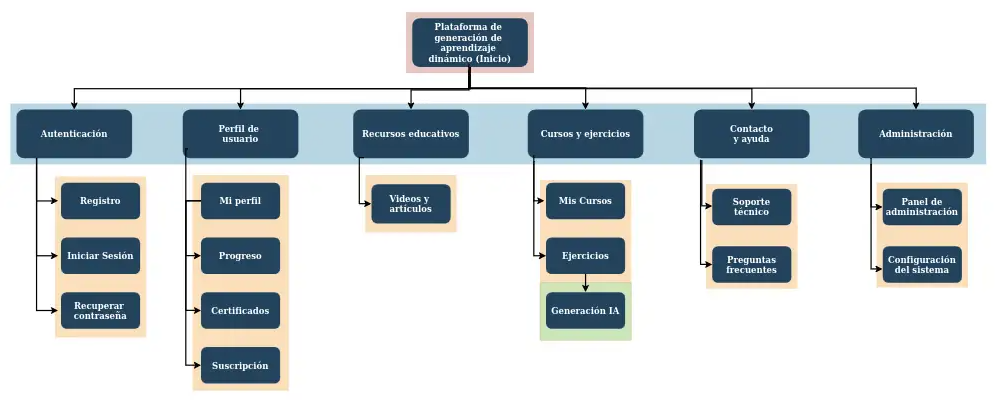
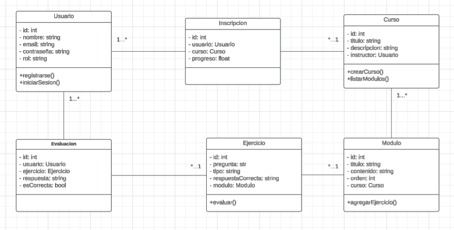

# TP Integrador - Entrega 1

## Programación en Ambiente Web

### **Integrantes**

- Buzzo Marcelo, Rocco   |   Legajo: 190292
- Cardona, Eliana        |   Legajo: 118441
- Pereyra Buch, Bautista |   Legajo 193177

## Plataforma de Aprendizaje Dinámico

### **Descripción General**

La plataforma permitirá a los usuarios acceder a cursos estructurados en módulos, con ejercicios diseñados y evaluados en función de respuestas previamente cargadas por el instructor. La administración de los cursos será manual, asegurando calidad en el contenido y la evaluación.

La inteligencia artificial se empleará como herramienta de apoyo, sugiriendo materiales adicionales al finalizar un módulo. Estos recursos pueden incluir enlaces a páginas web, videos explicativos y, eventualmente, ejercicios adicionales.

### **Características principales**

1. **Estructura modular de cursos:**
    - Se ofrecerán 3 o 4 cursos, cada uno con 5 o 6 módulos.
    - Cada módulo contendrá teoría y ejercicios prácticos.
2. **Evaluación de ejercicios:**
    - Corrección automática en base a respuestas predefinidas por el instructor.
3. **Sugerencias de contenido con IA:**
    - Recomendaciones automáticas de videos, artículos y recursos tras completar un módulo.
4. **Foro de discusión (en evaluación):**
    - Posible implementación de un espacio de interacción entre usuarios.
5. **Tecnologías a utilizar:**
    - Frontend: HTML5, CSS, JavaScript.
    - Backend: PHP.
    - Base de datos: A definir (posiblemente MySQL o PostgreSQL).

---

## **Presupuesto Funcional**

### **1. Autenticación y Gestión de Usuarios**

- Registro de usuarios (estudiantes e instructores).
- Inicio de sesión y recuperación de contraseña.  
- Gestión de perfil y roles de usuario.  

### **2. Gestión de Cursos y Módulos**

- Creación, edición y eliminación de cursos.
- Inscripción y seguimiento del progreso del usuario.  

### **3. Evaluaciones y Corrección de Ejercicios**

- Creación y evaluación de ejercicios.
- Registro del desempeño del usuario.  

### **4. IA para Sugerencia de Contenidos**  

- Generación de enlaces a videos y artículos relevantes.  

### **5. Panel de Usuario**

- Visualización de cursos inscriptos y progreso.  
- Historial de evaluaciones y resultados.  

### **6. Foro de Discusión (Opcional)**

- Creación y moderación de temas de discusión.  

### **7. Administración del Sistema (Instructores/Admins)**  

- Administración de cursos, usuarios y evaluaciones.  

#### **Infraestructura necesaria**
- **Hosting web:** Un servidor que soporte PHP y la base de datos elegida.
- **Dominio web:** URL para acceder a la plataforma.
- **Almacenamiento y ancho de banda.**.

#### **Recursos humanos**
- **Desarrolladores:** Responsables de frontend y backend.
- **Instructores o administradores:** Encargados de la carga y gestión de contenido.

---

## **Presupuesto Temporal**

| **Fase**                     | **Duración**  | **Tareas Claves**  |
|------------------------------|--------------|--------------------|
| **Planificación inicial**    | 22hs equipo  | Definir requerimientos, diseñar arquitectura, elegir tecnologías, asignar tareas. |
| **Diseño de la plataforma**  | 22hs equipo  | Crear wireframes, diseñar UI/UX, definir estructura de la base de datos. |
| **Autenticación y base del sistema**   | 66hs equipo    | Implementar autenticación e inicio de sesión, base de datos inicial, navegación básica.  |
| **Gestión de cursos y módulos**  | 66hs equipo  | Gestión de cursos y módulos, interfaz para carga y visualización de contenido.|
| **Sistema de ejercicios**  | 66hs equipo   | Carga y corrección de ejercicios, entorno de ejecución, interfaz de resolución. |
| **Personalización y progreso**  | 22hs equipo  | Sistema de puntos y progreso, interfaz gráfica, recomendaciones básicas. |
| **Integración de IA**        | 22hs equipo   | Implementar sugerencias de contenido con IA. |
| **Certificación**   | 22hs equipo    | Generación de certificados y validación de cursos. |
| **Pruebas y correcciones**   | 22hs equipo    | Realizar pruebas funcionales y corregir errores. |
| **Despliegue y documentación** | 22hs equipo | Configurar servidor, desplegar la plataforma, documentar el sistema. |

---

## **Sitemap**



## **Wireframes del sitio Web**

# TP Integrador - Entrega 2

> Link a https://www.figma.com/design/uZdxBAje5vXS4cDJrv0ImX/TPI-PAW?node-id=2-402&p=f&t=XEqmoAcPtISWd8uh-0

## **Arquitectura de la Aplicacion**

Usuario -> Capa de presentación (Frontend) -> Capa de lógica (PHP: controladores, servicios) -> Capa de datos (Modelo + Base de datos)

## **Modelo de Objetos**



# Plataforma de Aprendizaje Dinámico (PAD) - Entrega 3

Este proyecto es una aplicación web desarrollada en PHP con arquitectura MVC, cuyo objetivo es ofrecer una plataforma de aprendizaje estructurada en cursos, unidades, ejercicios y evaluaciones.

## Descripción General

La Plataforma de Aprendizaje Dinámico (PAD) permite a los usuarios:
- Registrarse e iniciar sesión.
- Crear cursos con unidades, ejercicios y evaluaciones.
- Consultar una lista de cursos.
- Visualizar preguntas frecuentes (FAQ).
- Administrar su perfil personal.


## Tecnologías Utilizadas

| Tecnología     | Utilidad    |
|----------------|-------------|
| HTML		 | Maquetado   |
| CSS		 | Estilo      |
| PHP            | Programación en backend |
| Composer       | Gestión de dependencias |
| Servidor local | PHP built-in (`php -S`) |
| Render         | Para despliegue final |
| Docker         | Para contenedorización y despliegue |

**Frameworks / Librerías:**
  - [Whoops](https://github.com/filp/whoops) (gestión de errores amigable)
  - [Monolog](https://github.com/Seldaek/monolog) (sistema de logging)
  - [PHPMailer](https://github.com/PHPMailer/PHPMailer) (envío de emails)
  - [PHP Dotenv](https://github.com/vlucas/phpdotenv) (manejo de variables de entorno)


## Instalación Local

### Requisitos

- PHP instalado en el sistema 
- Composer instalado globalmente
- Editor de texto recomendado: VS Code
- Git (opcional)

### Pasos de instalación

1. Clonar o descomprimir el proyecto:

```bash
git clone https://github.com/usuario/PAW-Integrador.git
cd PAW-Integrador
````

2. Instalar dependencias con Composer:

```bash
composer install
```

3. Ejecutar servidor local:

```bash
php -S localhost:8000 -t public
```

4. Acceder a la aplicación desde el navegador:

```
http://localhost:8000
```

### Archivos de configuración modificados

#### `php.ini`

Verificar que las siguientes líneas estén habilitadas:

```ini
extension=pdo_mysql
display_errors = On
error_reporting = E_ALL
```

## Funcionamiento de la Aplicación

Las rutas principales están definidas en `router.php`. Algunas de ellas incluyen:

* `/` → Página de inicio.
* `/cursos` → Lista de cursos.
* `/agregar-curso` → Formulario para agregar un curso.
* `/agregar-unidades` → Formulario para agregar unidades.
* `/login` y `/register` → Autenticación de usuarios.
* `/user-profile` → Vista del perfil del usuario.

Controladores principales:

* `ControladorPagina`: maneja las vistas y operaciones generales.
* `ControladorError`: maneja errores como `404` y `500`.


## Despliegue en Render con Docker

Para subir esta aplicación a internet, se utilizará Render con Docker, el dominio asignado fue: https://paw-integrador.onrender.com/.

Base de datos:
   Usamos el diagrama `modelo.png` como guía, actualmente guardamos los datos de usuarios en usuarios.txt y la información de los cursos en cursos.json.

## Registro de errores

* Todos los errores se registran en el directorio `logs/`.
* El sistema utiliza Monolog para registrar eventos importantes.
* Whoops proporciona trazas detalladas en entorno de desarrollo.
